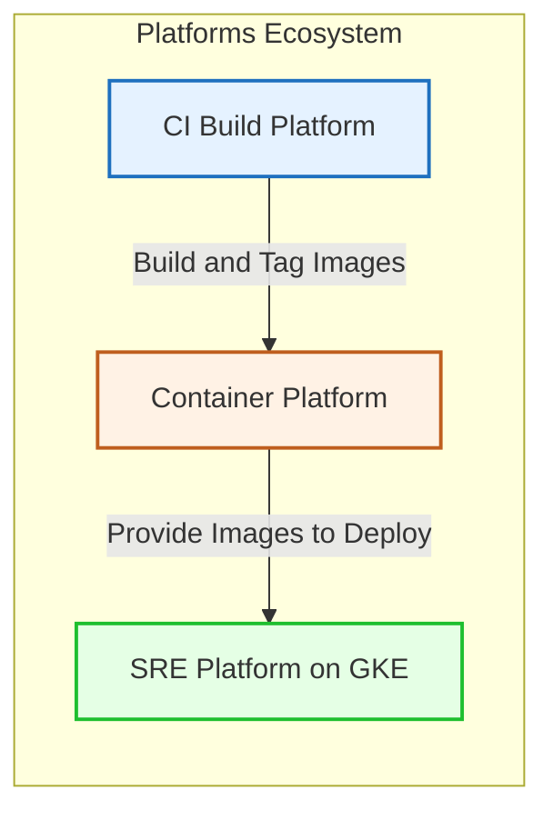

# SLO-Driven Progressive Delivery Platform

## Overview

This repository implements a GitOps-based SRE platform that governs application releases using **Service Level Objectives (SLOs)** and error budgets instead of raw infrastructure metrics.

The platform is designed as a production-grade observability and release-governance example, demonstrating how modern SRE teams can safely deliver microservices using automated, explainable decisions.

End-to-end lifecycle:

> Build → Deploy → Observe → Evaluate SLO → Decide → Promote or Rollback

## Why SLO-driven delivery

Traditional deployments answer questions like **"Is CPU high?"** or **"Is memory above a threshold?"**.

This platform instead focuses on:

- **"Are users experiencing degraded service quality?"**
- **"How fast are we burning the error budget?"**

Release decisions are based on:

- Latency SLO
- Availability SLO
- Multi-window burn rate
- Remaining error budget

This produces delivery behavior that is aligned with user experience, not just infrastructure noise.

## Core capabilities

### GitOps deployment

- ArgoCD-style GitOps workflow for Kubernetes state
- Helm-based reusable charts
- Clear separation of configuration and runtime state

### Progressive delivery

- Canary-style rollout strategy
- Gradual traffic shifting
- Automatic rollback when SLOs regress

### SLO-driven observability

- kube-prometheus-stack for metrics, alerting, and dashboards
- Prometheus recording rules for SLI/SLO computation
- Grafana dashboards focused on SLOs and error budgets

Key SLIs:

- Latency SLI
- Error-rate SLI
- Error-budget tracking over time

### Multi-window burn rate (Google SRE model)

Release health is evaluated using multiple time windows, for example:

- **Short window** – fast detection of sharp regressions
- **Long window** – noise protection and resilience to small spikes

This avoids noisy rollbacks while reacting quickly to real incidents.

### Policy-as-Code governance

Release decisions can be codified as policies, for example using OPA/Rego, to:

- Gate promotions when SLO risk is detected
- Block merges when error-budget burn is unsafe
- Keep release behavior auditable and reviewable as code

### Explainable delivery

Each deployment is intended to surface:

- Current SLO state at release time
- Burn-rate evaluation
- Clear decision: **promote** or **rollback**
- Human-readable explanation for the outcome

### Observability dashboards

Dashboards emphasize:

- Error budget remaining
- Live burn rate
- Canary health
- Release decision flag (GREEN / RED)
- Rollout progress

## Conceptual deployment flow

1. Developer opens a PR
2. CI builds and pushes container images
3. GitOps layer syncs desired state to the cluster
4. Canary rollout begins
5. Prometheus evaluates SLOs and burn rate
6. Policy engine evaluates release risk
7. The system either **promotes** or **rolls back** the release

## Demonstration scenario

The platform is designed for deterministic, repeatable failure tests. A typical scenario:

1. Deploy a healthy version of the service
2. Start synthetic load using k6
3. Inject latency and/or errors
4. Observe burn-rate spikes and error-budget consumption
5. Watch the rollout automatically abort
6. See merge or promotion blocked when risk is too high

## Repository layout

- [`charts/`](charts/)
  - [`charts/platform/Chart.yaml`](charts/platform/Chart.yaml)
  - [`charts/platform/values.yaml`](charts/platform/values.yaml)
  - [`charts/platform/templates/deployment.yaml`](charts/platform/templates/deployment.yaml)

- [`dashboards/`](dashboards/)
  - [`dashboards/slo-dashboard.json`](dashboards/slo-dashboard.json)

- [`docs/`](docs/)
  - [`docs/architecture.md`](docs/architecture.md)
  - [`docs/load-to-slo-timeline.md`](docs/load-to-slo-timeline.md)

- [`k6/`](k6/)
  - [`k6/k8s-job.yaml`](k6/k8s-job.yaml)
  - [`k6/chaos-load/checkout-spike.js`](k6/chaos-load/checkout-spike.js)
  - [`k6/chaos-load/sustained-load.js`](k6/chaos-load/sustained-load.js)

- [`observability/`](observability/)
  - [`observability/alerts/burn-rate-alerts.yaml`](observability/alerts/burn-rate-alerts.yaml)
  - [`observability/slo/checkout-slo.yaml`](observability/slo/checkout-slo.yaml)
  - [`observability/slo/frontend-slo.yaml`](observability/slo/frontend-slo.yaml)
  - [`observability/helm/kube-prometheus-stack/values.yaml`](observability/helm/kube-prometheus-stack/values.yaml)

- [`terraform/`](terraform/)
  - [`terraform/gke/gke-cluster.tf`](terraform/gke/gke-cluster.tf)
  - [`terraform/gke/node-pools.tf`](terraform/gke/node-pools.tf)
  - [`terraform/gke/variables.tf`](terraform/gke/variables.tf)
  - [`terraform/gke/outputs.tf`](terraform/gke/outputs.tf)
  - [`terraform/monitoring/namespaces.tf`](terraform/monitoring/namespaces.tf)
  - [`terraform/networking/vpc.tf`](terraform/networking/vpc.tf)

## Engineering principles

- GitOps-first operations
- Immutable artifacts
- SLOs instead of static thresholds
- Progressive-delivery safety mechanisms
- Policy-as-Code governance
- Observability-driven automation
- Explainable platform decisions

## What this project demonstrates

This repository is intended to showcase practical experience with:

- DevOps and platform architecture
- Site Reliability Engineering practices
- Kubernetes production delivery patterns
- Observability and SLO design
- Release-risk management with error budgets

## Definition of done

The platform is considered successful when:

- Canary rollouts execute automatically
- SLO violations trigger rollback without manual intervention
- Error-budget metrics reflect real user-impacting degradation
- Git or CI-based gates block risky releases
- Dashboards clearly explain why a release was promoted or rolled back

## Future extensions (out of scope)

Deliberately excluded to keep the example focused:

- Service mesh integration
- Multi-cluster or multi-region federation
- ML-based anomaly detection
- Custom Kubernetes operators

## Prerequisites and ecosystem

This SRE platform consumes immutable container images built and published by separate platforms:

- CI Build Platform – builds and tags container images
- Container Platform – immutable image registry (for example, Docker Hub)
- SRE Platform (this repository) – GitOps deployment + SLO governance

Images are built once and then treated as immutable artifacts that flow through the ecosystem:

> CI Build Platform → Container Platform → SRE Platform (GKE)

## Platform ecosystem

The full platform consists of three main components:

- [CI Build Platform](https://github.com/DimitryZH/ci-build-platform)
- [Container Platform (GitHub)](https://github.com/DimitryZH/container-platform) and [Docker Hub Repository](https://hub.docker.com/u/dmitryzhuravlev)
- [SRE Platform (this repo)](https://github.com/DimitryZH/ecommerce-observability-platform)

