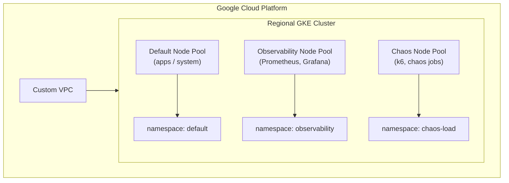
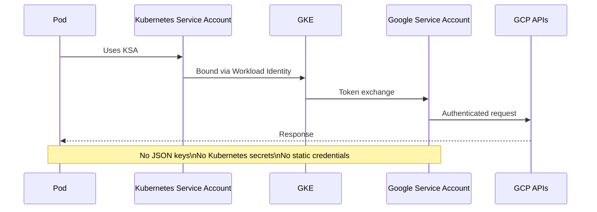
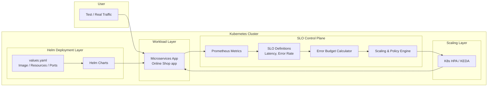

#  E-commerce Observability & SRE Platform on GKE

SLO-driven reliability and observability platform for microservices on GKE, focusing on load-induced behavior, burn rate–based alerting, autoscaling, and recovery validation.

This project demonstrates a real-world SRE approach to operating microservices on GKE using Service Level Objectives instead of raw metrics.

## Core Pillars
- GKE production infrastructure (Terraform)
- Prometheus-based SLO observability
- k6 load testing inside Kubernetes
- Error-budget driven alerting and scaling

## Focus areas
- SLO
- burn rate
- load-driven behavior
- autoscaling
- recovery
- GKE

## Prerequisites
The SRE platform treats container images as immutable artifacts and are consumed from an external CI build system.
Image tags are pinned to specific Git commit SHAs to guarantee reproducible deployments.
Container images used in this platform are produced by a dedicated CI build system.
See my project: [CI Build Platform](https://github.com/DimitryZH/ci-build-platform).

## High-level architecture diagram

## Security diagram

## Helm boundary vs SLO Control Plane

