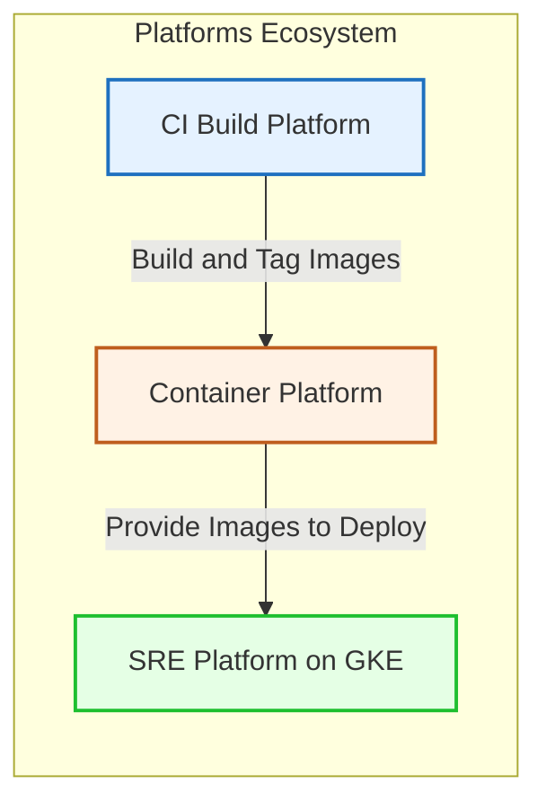

# SLO-Driven Progressive Delivery Platform

## Overview

The platform is built around **Service Level Objectives (SLOs)** rather than infrastructure metrics.
Production-grade GitOps observability and release governance platform demonstrating how modern SRE teams safely deliver microservices using SLO-based automated decisions instead of static thresholds.

This project implements a full delivery lifecycle:

Build → Deploy → Observe → Evaluate SLO → Decide → Promote or Rollback

## Project Goal

Traditional deployments rely on CPU, memory, or error thresholds.

Real production systems fail differently.

This platform shows how deployments can be governed by Service Level Objectives (SLOs) and error budget consumption, enabling:

safe canary releases

automated rollback

policy-driven release governance

explainable delivery decisions
## Key Concept

Instead of asking:

“Is CPU high?”

we ask:

“Are users experiencing degraded service quality?”

Release decisions are based on:

latency SLO

availability SLO

multi-window burn rate

remaining error budget

## Core Capabilities
### GitOps Deployment

ArgoCD manages all Kubernetes state

Helm reusable charts

Environment separation:

dev

stage

prod

### Progressive Delivery

Argo Rollouts canary deployments

gradual traffic shifting

automatic rollback

### SLO-Driven Observability

kube-prometheus-stack

Prometheus recording rules

Grafana SLO dashboards

Metrics evaluated using:

latency SLI

error rate SLI

error budget tracking

### Multi-Window Burn Rate (Google SRE Model)

Release health is evaluated using:

short window (fast detection)

long window (noise protection)

This prevents rollback from short spikes while reacting to real incidents.

### Policy-as-Code Governance

Release decisions are evaluated via:

OPA (Open Policy Agent)

Rego policies

automated GitHub checks

If SLO risk is detected:

 merge is automatically blocked.

### Explainable Delivery

Every deployment produces:

live SLO snapshot

burn rate evaluation

release decision reason

Engineers can see why a release failed.

### Observability Dashboards

Single “killer” dashboard includes:

Error Budget Remaining

Live Burn Rate

Canary Health

Release Decision Flag (GREEN / RED)

Rollout Progress

## Deployment Lifecycle
Developer PR
      ↓
CI builds image
      ↓
ArgoCD sync
      ↓
Canary rollout starts
      ↓
Prometheus evaluates SLO burn
      ↓
OPA policy decision
      ↓
✅ Promote OR ❌ Rollback

## Demonstration Scenario

The platform intentionally supports deterministic failure testing.

You can:

Deploy healthy version

Start k6 load tests

Inject latency/errors

Observe burn rate spike

Watch automatic rollback

See merge blocked in GitHub

## Quick Start (Conceptual)
make bootstrap   # create cluster + install core stack
make deploy      # deploy ecommerce services
make load        # start k6 load
make break       # trigger SLO violation

Expected result:

burn rate increases

error budget drops

rollout aborts automatically

## Repository Structure
charts/              reusable Helm logic
environments/        dev / stage / prod configs
argocd/              GitOps applications
observability/       Prometheus + Grafana config
policies/            OPA SLO policies
docs/
  architecture.md
  slo-design.md
  load-to-slo-timeline.md
  burn-rate-alerts.md

## Engineering Principles

GitOps-first operations

Immutable artifacts

SLO instead of thresholds

Progressive delivery safety

Policy-as-Code governance

Observability-driven automation

Explainable platform decisions

## What This Project Demonstrates

This repository is designed to showcase practical knowledge of:

DevOps platform architecture

Site Reliability Engineering practices

Kubernetes production delivery

Observability design

Release risk management

## Definition of Done

The platform is successful when:

canary rollout occurs automatically

SLO violation triggers rollback

error budget reflects degradation

GitHub merge is blocked by policy

dashboards clearly explain the decision

## Future Extensions (Out of Scope)

Intentionally excluded:

service mesh

multi-cluster federation

ML anomaly detection

custom Kubernetes operators

## High-level architecture diagram

## Prerequisites
This SRE platform consumes immutable container images produced by the CI Build Platform and stored in the Container Platform. 

## Platform Architecture

The ecosystem consists of three independent but connected platforms:

CI Build Platform — builds and tags container images

Container Platform — immutable image registry (Docker Hub)

SRE Platform (this repo) — GitOps deployment + SLO governance

Images are built once and consumed as immutable artifacts.

CI Build Platform → Container Platform → SRE Platform (GKE)

# Platform ecosystem

The full platform consists of three main components:

- [CI Build Platform](https://github.com/DimitryZH/ci-build-platform)
- [Container Platform (GitHub)](https://github.com/DimitryZH/container-platform) and [Docker Hub Repository](https://hub.docker.com/u/dmitryzhuravlev)
- [SRE Platform (this repo)](https://github.com/DimitryZH/ecommerce-observability-platform)

