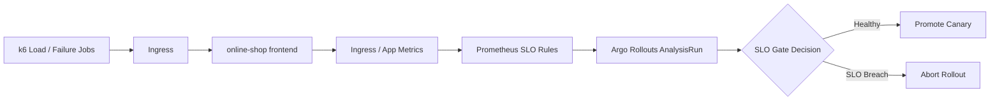
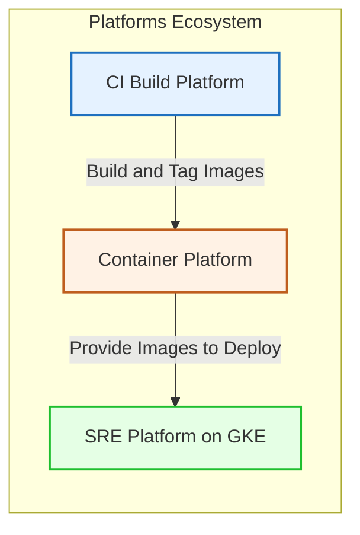

# SLO-Driven Progressive Delivery Platform

## Overview

This repository implements a GitOps-based SRE platform that governs application releases using **Service Level Objectives (SLOs)** and error budgets instead of raw infrastructure metrics.

The platform is designed as a production-grade observability and release-governance example, demonstrating how modern SRE teams can safely deliver microservices using automated, explainable decisions.

End-to-end lifecycle:

> Build → Deploy → Observe → Evaluate SLO → Decide → Promote or Rollback

## Why SLO-driven delivery

Traditional deployments answer questions like **"Is CPU high?"** or **"Is memory above a threshold?"**.

This platform instead focuses on:

- **"Are users experiencing degraded service quality?"**
- **"How fast are we burning the error budget?"**

Release decisions are based on:

- Latency SLO
- Availability SLO
- Multi-window burn rate
- Remaining error budget

This produces delivery behavior that is aligned with user experience, not just infrastructure noise.

## Live SLO Validation (Quick View)

This platform demonstrates **SLO-driven observability using real traffic and controlled error injection**.

### What is validated

- Healthy baseline (no errors, zero burn)
- Error injection (`/break` → HTTP 500)
- SLO impact (`error_ratio` and burn-rate spike)
- Multi-window behavior (fast vs long burn windows)
- Fast alert lifecycle (pending → firing → recovery)
- Clean-slate gating due to long-window burn persistence

---

### Explore

- Full visual evidence:  
  [`docs/observability/screenshots/`](docs/observability/screenshots/)

- Grafana dashboard:  
  [`observability/grafana/global-slo-dashboard.json`](observability/grafana/global-slo-dashboard.json)

- Full validation report:  
  [`docs/slo_validation_dev_environment.md`](docs/slo_validation_dev_environment.md)

## SLO-Gated Progressive Delivery (Validated)

Validated outcomes in `online-shop-dev`:
- SLO-driven rollout decisions at both canary gates (10% and 50%)
- Automatic abort when burn-rate/error-ratio breach thresholds
- Multi-stage healthy-path promotion to 100% when signals stay healthy
- Operational recovery from `Degraded` back to `Healthy` after abort

Artifacts:
- Case Study: [`docs/case-study/slo_rollout_demo.md`](docs/case-study/slo_rollout_demo.md)
- Evidence: [`docs/evidence/slo_gated_rollout_evidence_dev.md`](docs/evidence/slo_gated_rollout_evidence_dev.md)
- CLI Evidence: [`docs/evidence/slo_gated_rollout_cli_excerpts_dev.md`](docs/evidence/slo_gated_rollout_cli_excerpts_dev.md)

## Load and Failure Testing with k6

k6 is used to run deterministic, repeatable traffic scenarios that directly validate SLO-driven rollout decisions in `online-shop-dev`.

Validated usage:
- baseline traffic maintains a healthy denominator for SLO evaluation
- failure-10 and failure-50 scenarios simulate controlled error conditions
- each scenario maps directly to a rollout promotion gate (10% and 50%)
- SLO breaches trigger automated abort decisions during canary rollout
- run evidence is captured under [`docs/evidence/load-runs/`](docs/evidence/load-runs/)

Scenarios are deterministic and aligned with rollout analysis windows to ensure reproducible SLO evaluation.

Scenario mapping:
- `baseline` → healthy steady-state traffic (no SLO impact)
- `failure-10` → early-stage SLO breach at 10% canary gate
- `failure-50` → mid-rollout SLO breach at 50% canary gate

Operator guide:
- [`k6/README.md`](k6/README.md)
- [`docs/case-study/slo_rollout_demo.md`](docs/case-study/slo_rollout_demo.md)
- [`docs/evidence/slo_gated_rollout_evidence_dev.md`](docs/evidence/slo_gated_rollout_evidence_dev.md)

```mermaid
flowchart LR
    K6[k6 Load / Failure Jobs] --> Ingress[Ingress]
    Ingress --> App[online-shop frontend]
    App --> Metrics[Ingress / App Metrics]
    Metrics --> Prometheus[Prometheus SLO Rules]
    Prometheus --> Analysis[Argo Rollouts AnalysisRun]
    Analysis --> Decision{SLO Gate Decision}
    Decision -->|Healthy| Promote[Promote Canary]
    Decision -->|SLO Breach| Abort[Abort Rollout]
```

## Core capabilities

### GitOps deployment

- ArgoCD-style GitOps workflow for Kubernetes state
- Helm-based reusable charts
- Clear separation of configuration and runtime state

### Progressive delivery

- Canary-style rollout strategy
- Gradual traffic shifting
- Automatic rollback when SLOs regress

### SLO-driven observability

- kube-prometheus-stack for metrics, alerting, and dashboards
- Prometheus recording rules for SLI/SLO computation
- Grafana dashboards focused on SLOs and error budgets

Key SLIs:

- Latency SLI
- Error-rate SLI
- Error-budget tracking over time

### Multi-window burn rate (Google SRE model)

Release health is evaluated using multiple time windows, for example:

- **Short window** – fast detection of sharp regressions
- **Long window** – noise protection and resilience to small spikes

This avoids noisy rollbacks while reacting quickly to real incidents.

### Policy-as-Code governance

Release decisions can be codified as policies, for example using OPA/Rego, to:

- Gate promotions when SLO risk is detected
- Block merges when error-budget burn is unsafe
- Keep release behavior auditable and reviewable as code

### Explainable delivery

Each deployment is intended to surface:

- Current SLO state at release time
- Burn-rate evaluation
- Clear decision: **promote** or **rollback**
- Human-readable explanation for the outcome

### Observability dashboards

Dashboards emphasize:

- Error budget remaining
- Live burn rate
- Canary health
- Release decision flag (GREEN / RED)
- Rollout progress

## Conceptual deployment flow

1. Developer opens a PR
2. CI builds and pushes container images
3. GitOps layer syncs desired state to the cluster
4. Canary rollout begins
5. Prometheus evaluates SLOs and burn rate
6. Policy engine evaluates release risk
7. The system either **promotes** or **rolls back** the release

## Demonstration scenario

The platform is designed for deterministic, repeatable failure tests. A typical scenario:

1. Deploy a healthy version of the service
2. Start synthetic load using k6
3. Inject latency and/or errors
4. Observe burn-rate spikes and error-budget consumption
5. Watch the rollout automatically abort
6. See merge or promotion blocked when risk is too high

## Repository layout

- [`charts/`](charts/)
  - [`charts/platform/Chart.yaml`](charts/platform/Chart.yaml)
  - [`charts/platform/values.yaml`](charts/platform/values.yaml)
  - [`charts/platform/templates/frontend-rollout.yaml`](charts/platform/templates/frontend-rollout.yaml)

- [`argocd/`](argocd/)
  - [`argocd/apps/root.yaml`](argocd/apps/root.yaml)

- Progressive delivery manifests are packaged in Helm under [`charts/platform/templates/`](charts/platform/templates/frontend-rollout.yaml).

- [`observability/grafana/`](observability/grafana/)
  - [`observability/grafana/global-slo-dashboard.json`](observability/grafana/global-slo-dashboard.json)

- [`docs/`](docs/)
  - [`docs/architecture.md`](docs/architecture.md) – Architecture doc guide for the SLO-driven platform
  - [`docs/load-to-slo-timeline.md`](docs/load-to-slo-timeline.md)

- [`k6/`](k6/)
  - [`k6/README.md`](k6/README.md)
  - [`k6/scripts/baseline.js`](k6/scripts/baseline.js)
  - [`k6/scripts/failure.js`](k6/scripts/failure.js)
  - [`k6/scripts/capture_load_run_evidence.sh`](k6/scripts/capture_load_run_evidence.sh)
  - [`k6/k8s/job-baseline.yaml`](k6/k8s/job-baseline.yaml)
  - [`k6/k8s/job-failure-10.yaml`](k6/k8s/job-failure-10.yaml)
  - [`k6/k8s/job-failure-50.yaml`](k6/k8s/job-failure-50.yaml)

- [`observability/`](observability/)
  - [`observability/slo/checkout-slo.yaml`](observability/slo/checkout-slo.yaml)
  - [`observability/slo/frontend-slo.yaml`](observability/slo/frontend-slo.yaml)
  - [`observability/helm/kube-prometheus-stack/values.yaml`](observability/helm/kube-prometheus-stack/values.yaml)

- [`policies/`](policies/)
  - [`policies/slo_v1.rego`](policies/slo_v1.rego)
  - [`policies/slo_v2.rego`](policies/slo_v2.rego)
  - [`policies/slo-policy.yaml`](policies/slo-policy.yaml)

- [`terraform/`](terraform/)
  - [`terraform/README.md`](terraform/README.md)
  - [`terraform/main.tf`](terraform/main.tf)
  - [`terraform/variables.tf`](terraform/variables.tf)
  - [`terraform/outputs.tf`](terraform/outputs.tf)

## Engineering principles

- GitOps-first operations
- Immutable artifacts
- SLOs instead of static thresholds
- Progressive-delivery safety mechanisms
- Policy-as-Code governance
- Observability-driven automation
- Explainable platform decisions

## What this project demonstrates

This repository is intended to showcase practical experience with:

- DevOps and platform architecture
- Site Reliability Engineering practices
- Kubernetes production delivery patterns
- Observability and SLO design
- Release-risk management with error budgets

## Definition of done

The platform is considered successful when:

- Canary rollouts execute automatically
- SLO violations trigger rollback without manual intervention
- Error-budget metrics reflect real user-impacting degradation
- Git or CI-based gates block risky releases
- Dashboards clearly explain why a release was promoted or rolled back

## Future extensions (out of scope)

Deliberately excluded to keep the example focused:

- Service mesh integration
- Multi-cluster or multi-region federation
- ML-based anomaly detection
- Custom Kubernetes operators

## Prerequisites and ecosystem

This SRE platform consumes immutable container images built and published by separate platforms:

- CI Build Platform – builds and tags container images
- Container Platform – immutable image registry (for example, Docker Hub)
- SRE Platform (this repository) – GitOps deployment + SLO governance

Images are built once and then treated as immutable artifacts that flow through the ecosystem:

> CI Build Platform → Container Platform → SRE Platform (GKE)

## Platform ecosystem

The full platform consists of three main components:

- [CI Build Platform](https://github.com/DimitryZH/ci-build-platform)
- [Container Platform (GitHub)](https://github.com/DimitryZH/container-platform) and [Docker Hub Repository](https://hub.docker.com/u/dmitryzhuravlev)
- [SRE Platform (this repo)](https://github.com/DimitryZH/ecommerce-observability-platform)

```mermaid
flowchart LR
    CI[CI Build Platform] -->|Build and Tag Images| DockerHub[Container Platform]
    DockerHub -->|Provide Images to Deploy| SRE[SRE Platform on GKE]

    subgraph Platforms Ecosystem
        CI
        DockerHub
        SRE
    end

    style CI fill:#E5F2FF,stroke:#1E70BF,stroke-width:2px
    style DockerHub fill:#FFF2E5,stroke:#BF5E1E,stroke-width:2px
    style SRE fill:#E5FFE5,stroke:#1EBF2F,stroke-width:2px
```

