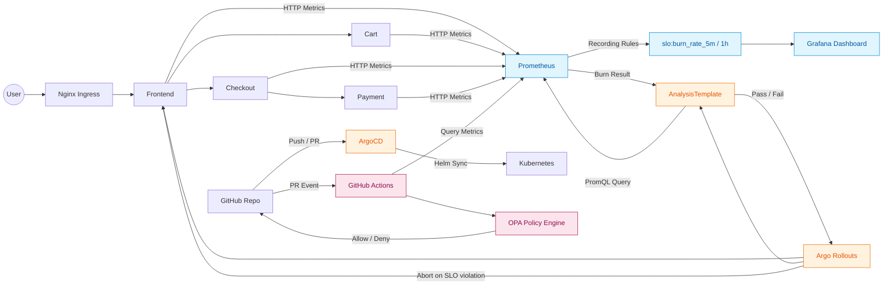
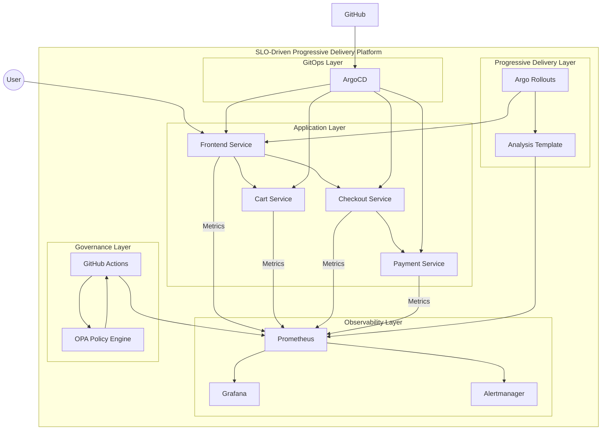
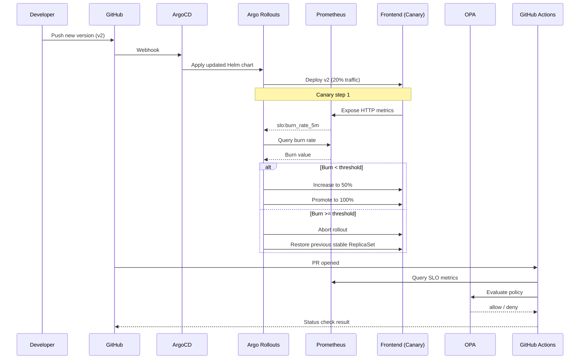
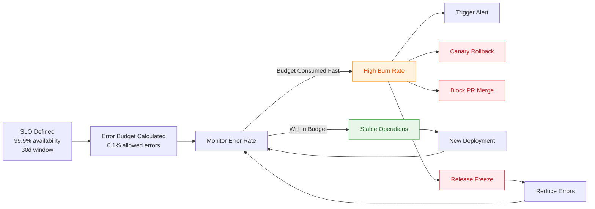
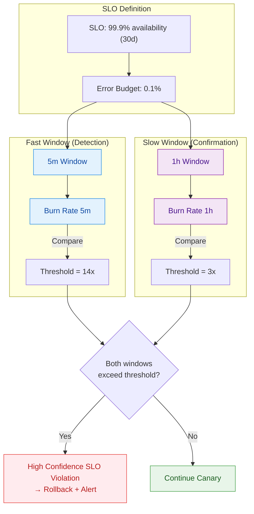
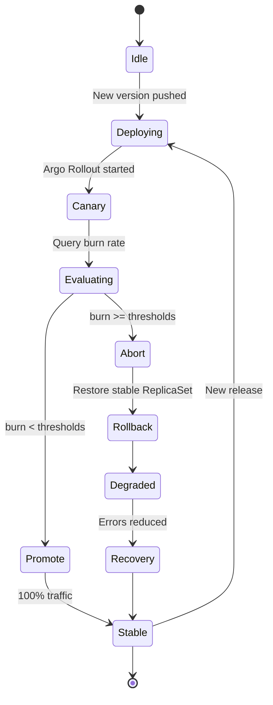

# Architecture Overview

This document explains the architecture of the **SLO-Driven Progressive Delivery Platform**, focusing on runtime data flow, GitOps, progressive delivery, SLO-based automation, and governance.

---

## 1. High-Level Architecture Diagram

### 1.1 Mermaid Diagram

### 1.2 What the Architecture Diagram Shows

The diagram highlights four main planes of the platform:

1. **Runtime Plane**
   - `User → Ingress → Services` (Frontend, Cart, Checkout, Payment)
   - Services expose HTTP metrics to Prometheus
   - Prometheus applies recording rules to compute burn-rate metrics
   - Grafana visualizes SLO and burn-rate data

2. **Progressive Delivery Plane**
   - Argo Rollouts manages canary deployments
   - AnalysisTemplates query Prometheus via PromQL
   - When burn rate exceeds thresholds, the rollout is aborted and traffic returns to the stable version

3. **GitOps Plane**
   - GitHub is the source of truth for desired state
   - ArgoCD syncs Kubernetes manifests (via Helm charts) into the cluster

4. **Governance Plane**
   - Pull Requests (PRs) trigger GitHub Actions workflows
   - GitHub Actions query Prometheus for SLO/SLI metrics
   - Metrics are evaluated by OPA (Open Policy Agent)
   - OPA returns **allow/deny** decisions that can block or approve merges

### 1.3 Key Architectural Concepts

- **Separation of concerns** between runtime, delivery, GitOps, and governance
- **Control loops** for both runtime (Rollouts + Prometheus) and governance (GitHub + OPA)
- **Observability-driven automation**, especially around SLO and burn rate
- **Policy-based governance** with OPA and GitHub checks
- **End-to-end feedback** from users and traffic back into deployment decisions

---

## 2. Environment Promotion Flow (dev → stage → prod)

### 2.1 Mermaid Diagram

```mermaid
flowchart LR

Developer[Developer] -->|Push feature branch| GitHub

GitHub -->|PR to dev| DevEnv[Dev Environment]
DevEnv -->|ArgoCD Sync| DevCluster[K8s Dev]

DevCluster -->|k6 Tests + SLO Check| DevValidation{SLO Healthy?}

DevValidation -->|Yes| PRStage[PR to stage]
DevValidation -->|No| FixDev[Fix & Re-push]

PRStage --> StageEnv[Stage Environment]
StageEnv -->|ArgoCD Sync| StageCluster[K8s Stage]

StageCluster -->|Canary + Burn Check| StageValidation{Burn < Threshold?}

StageValidation -->|Yes| PRProd[PR to prod]
StageValidation -->|No| RollbackStage[Auto Rollback]

PRProd --> ProdEnv[Production Environment]
ProdEnv -->|ArgoCD Sync| ProdCluster[K8s Prod]

ProdCluster -->|Canary + Multi-window Burn| ProdValidation{Release Decision}

ProdValidation -->|Allow| Stable[Promote to 100%]
ProdValidation -->|Deny| RollbackProd[Abort Rollout]

classDef env fill:#e3f2fd,stroke:#1e88e5,color:#0d47a1
classDef decision fill:#fff3e0,stroke:#fb8c00,color:#e65100
classDef action fill:#fce4ec,stroke:#d81b60,color:#880e4f

class DevEnv,StageEnv,ProdEnv env
class DevValidation,StageValidation,ProdValidation decision
class RollbackStage,RollbackProd action
```

### 2.2 What the Environment Flow Shows

- Each environment (**dev**, **stage**, **prod**) is fully managed via GitOps.
- Promotion between environments happens **only via Pull Requests**.
- **Stage** and **Prod** environments use **burn-rate gating** to decide if a release can proceed.
- **Production** uses **multi-window burn rate** to reduce noise and false positives.
- **Rollback is automatic** when burn-rate or SLO conditions are violated.

---

## 3. C4 Container Diagram

### 3.1 Mermaid Diagram (Container Level)

### 3.2 What the C4 Container Diagram Shows

#### Application Layer
- Business services: **Frontend**, **Cart**, **Checkout**, **Payment**.

#### Observability Layer
- **Prometheus** collects metrics from all services.
- **Alertmanager** handles alert routing.
- **Grafana** provides visualization.
- Metrics include error rate, latency, and burn-rate signals.

#### Progressive Delivery Layer
- **Argo Rollouts** drives canary deployments for application services.
- **AnalysisTemplates** encapsulate the PromQL-based SLO and burn-rate checks.
- Rollouts and AnalysisTemplates form a closed-loop controller for releases.

#### GitOps Layer
- **ArgoCD** syncs desired state from GitHub to Kubernetes.
- Each service's manifests (often via Helm charts) are managed declaratively.

#### Governance Layer
- **GitHub Actions** orchestrate CI/CD workflows and status checks.
- **OPA** provides policy-as-code for SLO and risk-based decisions.
- Together they enforce:
  - SLO-based merge gates
  - Policy-governed promotions
  - Auditable decision history

### 3.3 What the Diagram Demonstrates

- Multiple **control loops**:
  - Runtime loop: Argo Rollouts + Prometheus
  - Governance loop: GitHub + GitHub Actions + OPA
- Clear **separation of planes**: data, control, and governance.
- **Automated release policy** driven by observability signals.
- **Observability-first engineering**: metrics are not just for dashboards, but for decisions.

---

## 4. Canary Lifecycle (Sequence Diagram)

### 4.1 Mermaid Sequence Diagram

### 4.2 What the Canary Lifecycle Shows

- **GitOps-triggered deployment**: a push to GitHub leads to ArgoCD syncing the new release.
- **Step-based traffic shifting** via Argo Rollouts (e.g., 20% → 50% → 100%).
- **Prometheus-based SLO evaluation** using burn-rate queries.
- **Automatic rollback** when burn-rate thresholds are exceeded.
- **Parallel governance control** via GitHub Actions + OPA, which can:
  - Query SLO metrics
  - Evaluate policies
  - Mark PRs as pass/fail based on risk

### 4.3 Dual Control Loops

The sequence diagram illustrates a **dual control-loop pattern**:

1. **Runtime control loop** (Argo Rollouts + Prometheus)
   - Continuously evaluates SLO/burn-rate during rollout.
   - Decides to continue, promote, or rollback.

2. **Governance control loop** (GitHub + GitHub Actions + OPA)
   - Evaluates release risk at PR level.
   - Can block merges when SLOs or budgets are in danger.

---

## 5. Error Budget Lifecycle

### 5.1 Mermaid Diagram

### 5.2 What the Error Budget Lifecycle Shows

1. **Definition phase**
   - Define the SLO (e.g., 99.9% availability over 30 days).
   - Compute the corresponding **error budget** (e.g., 0.1% of requests can fail).

2. **Operations phase**
   - Continuously monitor error rate against the error budget.

3. **High burn phase**
   - When error budget is being consumed too quickly:
     - Trigger alerts.
     - Potentially rollback canary releases.
     - Block PR merges that would increase risk.
     - Optionally enforce a **release freeze**.

4. **Recovery phase**
   - After errors are reduced and the system recovers, monitoring resumes in a normal state.

---

## 6. Multi-Window Burn Rate (Google SRE Style)

### 6.1 Mermaid Diagram

### 6.2 Why Use 5m + 1h Windows

This section explains why the platform uses a **5-minute** and a **1-hour** window, following Google SRE practices.

- **Fast Window (5 minutes)**
  - Detects sharp spikes in errors quickly.
  - Highly sensitive to changes.
  - Can produce **false positives** if used alone.

- **Slow Window (1 hour)**
  - Confirms that a problem is sustained over time.
  - Filters out short-lived noise and transient issues.

- **Combined Behavior**
  - Rollback is triggered **only when both windows exceed their thresholds**.
  - This:
    - Reduces false or unnecessary rollbacks.
    - Increases confidence that a real SLO violation is occurring.
    - Aligns with established **Google SRE** burn-rate strategies.

---

## 7. Release Decision State Machine

### 7.1 Mermaid State Diagram

### 7.2 What the State Machine Shows

**States**:

- **Idle** – No active release is in progress.
- **Deploying** – A new version is being applied to the cluster.
- **Canary** – A subset of traffic is routed to the new version.
- **Evaluating** – The system evaluates multi-window burn rate and SLO metrics.
- **Promote** – Decision to route 100% of traffic to the new version.
- **Abort** – Burn rate exceeds thresholds; rollout is stopped.
- **Rollback** – Traffic is returned to the previously stable ReplicaSet.
- **Degraded** – The system is currently operating outside defined SLOs.
- **Recovery** – The system is recovering; error rates are decreasing and SLOs are being restored.
- **Stable** – The system is back within SLO and serving 100% traffic from the stable version.

This state machine captures the full lifecycle of a release and how SLO and burn-rate signals drive promotion, rollback, and recovery.

