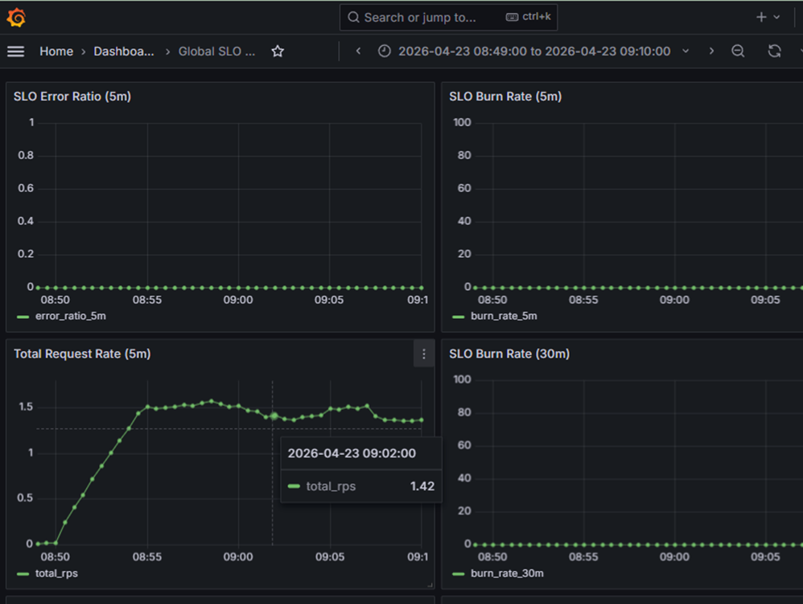
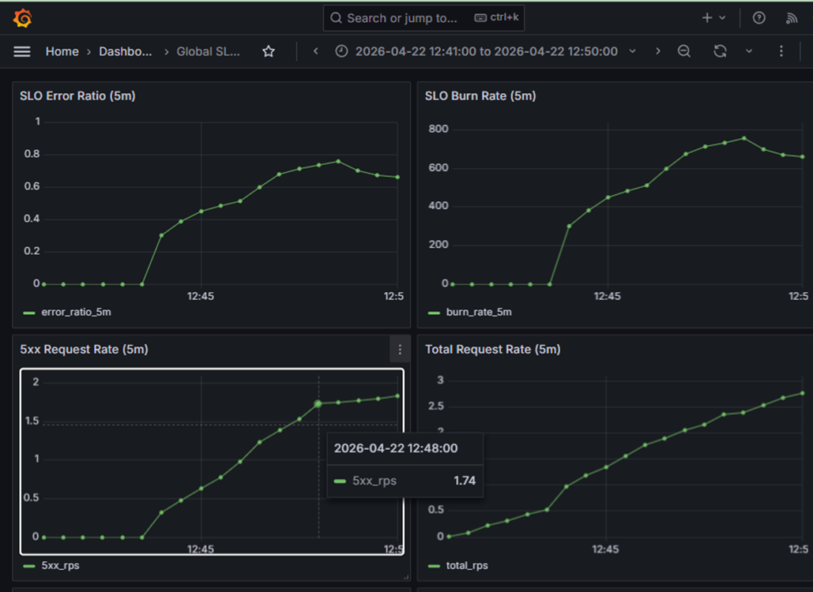
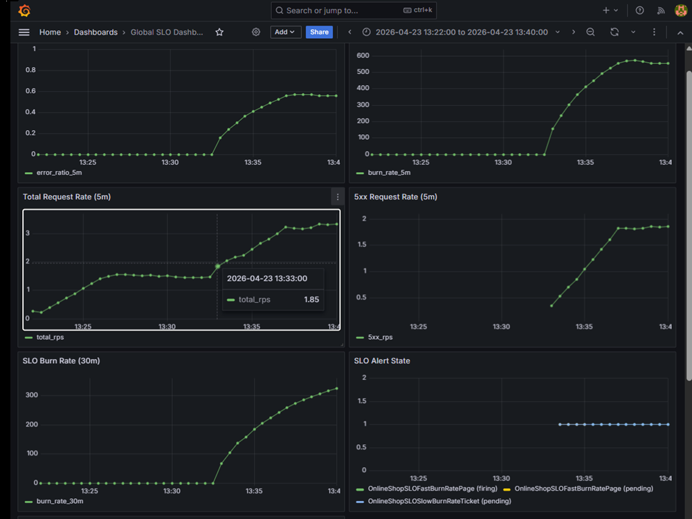

# SLO-Gated Rollout Demo Story - Dev (`online-shop-dev`)

## 1. Scenario Overview
This demo validates SLO-gated progressive delivery for frontend canary rollout in dev.

Validated scenarios:
- Healthy rollout: passes 10% gate and 50% gate, then promotes to 100%.
- Failure at 10%: controlled degradation fails first gate and aborts rollout.
- Failure at 50%: first gate passes, degradation at 50% fails second gate and aborts rollout.
- Recovery: aborted rollout is returned to clean healthy baseline.

## 2. Execution Flow (Per Scenario)

### Healthy Rollout
Scenario:
Healthy release candidate should pass both SLO gates and promote to 100%.

Action:
```bash
kubectl patch rollout frontend -n online-shop-dev --type merge --patch '{"spec":{"template":{"metadata":{"annotations":{"rollout-trigger":"<timestamp>"}}}}}'
```

```bash
kubectl get analysisrun -n online-shop-dev
```

System behavior:
- Rollout progressed to 10% and first analysis completed `Successful`.
- Rollout progressed to 50% and second analysis completed `Successful`.

Result:
- Rollout finished `Healthy` with stable 100 / canary 0.

### Failure at 10%
Scenario:
Degradation is injected during the first canary stage to test first-gate protection.

Action:
```bash
kubectl patch rollout frontend -n online-shop-dev --type merge --patch '{"spec":{"template":{"metadata":{"annotations":{"rollout-trigger":"<timestamp>"}}}}}'
```

```bash
kubectl run failurepath-break -n online-shop-dev --image=busybox:1.36 --restart=Never -- sh -c 'while true; do wget -q -O- http://ingress-nginx-controller.ingress-nginx.svc.cluster.local/break >/dev/null 2>&1; sleep 0.5; done'
```

System behavior:
- First AnalysisRun failed at 10%.
- `slo:error_ratio_5m` and `slo:burn_rate_5m` breached thresholds.

Result:
- Rollout aborted to `Degraded` before 50%.
- Weights returned to stable 100 / canary 0.

### Failure at 50%
Scenario:
First gate is allowed to pass, then degradation is introduced at 50% to test second-gate protection.

Action:
```bash
kubectl argo rollouts get rollout frontend -n online-shop-dev --watch
```

```bash
kubectl run second-gate-failure-break-traffic -n online-shop-dev --image=busybox:1.36 --restart=Never -- sh -c 'while true; do wget -q -O- http://ingress-nginx-controller.ingress-nginx.svc.cluster.local/break >/dev/null 2>&1; sleep 0.5; done'
```

```bash
kubectl get analysisrun -n online-shop-dev
```

System behavior:
- First gate passed and rollout reached 50%.
- Second AnalysisRun failed under controlled degradation.

Result:
- Rollout aborted before 100% promotion.
- Weights returned to stable 100 / canary 0.

### Recovery
Scenario:
After intentional abort testing, rollout state must be restored to clean baseline.

Action:
```bash
kubectl patch rollout frontend -n online-shop-dev --type merge --patch '{"spec":{"template":{"metadata":{"annotations":{"rollout-trigger":"<stable-rs-trigger>"}}}}}'
```

```bash
kubectl get rollout frontend -n online-shop-dev -o yaml
```

System behavior:
- Degraded/aborted state was cleared without changing rollout design.

Result:
- Rollout returned to `Healthy`; stable path remained available.

## 3. Visual Evidence
Figure 1. Argo CD healthy state for canonical dev app.


Caption: `online-shop-dev` is `Synced` and `Healthy`, proving healthy baseline and successful convergence.

Figure 2. Argo CD degraded state after canary gate failure.


Caption: `online-shop-dev` shows `Degraded` while synced, proving rollout health degraded due to failed canary decision rather than drift.

Figure 3. Grafana healthy window during successful gate progression.


Caption: `SLO Error Ratio (5m)` and `SLO Burn Rate (5m)` remain near zero with valid request traffic, supporting healthy gate pass behavior.

Figure 4. Grafana first-gate failure window (10% stage).


Caption: first-gate failure shows sharp rise in `5xx`, `error_ratio_5m`, and `burn_rate_5m`, proving objective SLO breach at early canary stage.

Figure 5. Grafana second-gate failure window (50% stage).


Caption: after first-gate pass, controlled degradation at 50% drives a second decisive SLO breach, proving second-gate abort protection before 100%.

## 4. Key Observations
- SLO measurements directly controlled promotion and abort decisions.
- Healthy conditions promoted releases through both canary gates.
- Controlled degradation caused automatic abort at both first and second gate.
- Stable service path remained available during abort scenarios.
- Post-abort recovery returned the system to a clean, testable baseline.

## 5. CLI Decision Evidence
Reference: [`docs/evidence/slo_gated_rollout_cli_excerpts_dev.md`](../evidence/slo_gated_rollout_cli_excerpts_dev.md)

Excerpt (healthy progression):
```text
STEP 1  setWeight: 10
STEP 2  analysis: frontend-slo-check -> Successful (frontend-5f574997f4-10-2)
STEP 4  setWeight: 50
STEP 5  analysis: frontend-slo-check -> Successful (frontend-5f574997f4-10-5)
STEP 7  phase: Healthy
weights: stable=100 canary=0
```

Excerpt (successful analysis list):
```bash
kubectl get analysisrun -n online-shop-dev
```
```text
frontend-5f574997f4-10-2  Successful
frontend-5f574997f4-10-5  Successful
```

Excerpt (second-gate failure decision):
```text
STEP 2  analysis -> Successful (frontend-795ff59896-11-2)
STEP 4  setWeight: 50
STEP 5  analysis -> Failed (frontend-795ff59896-11-5)
phase: Degraded
abort: true
weights: stable=100 canary=0
```
