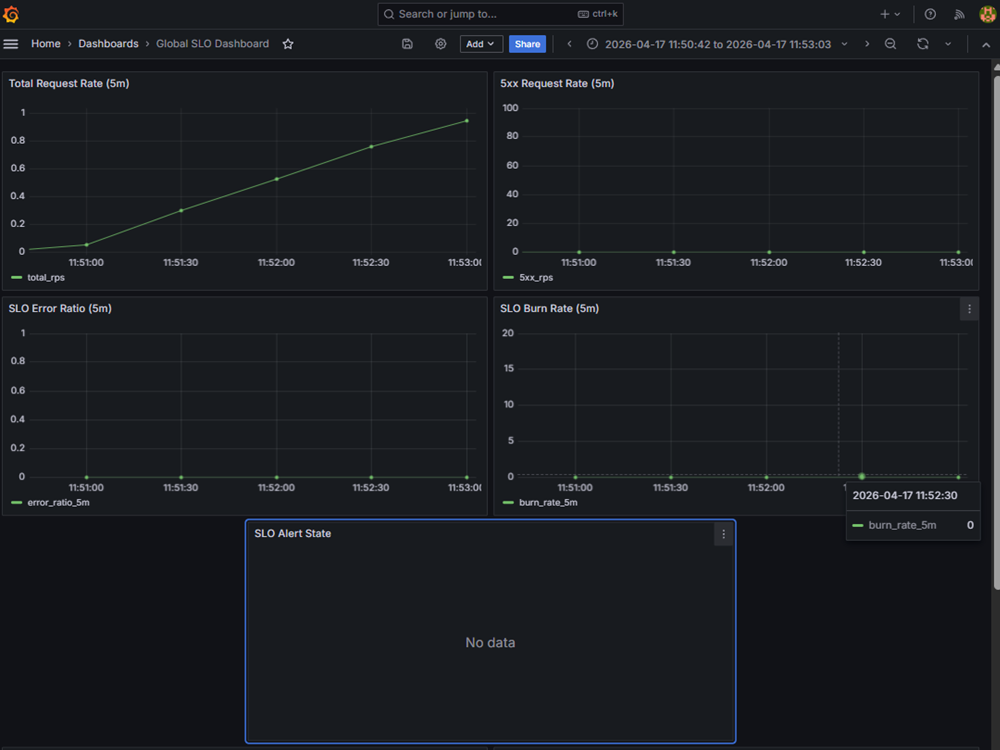
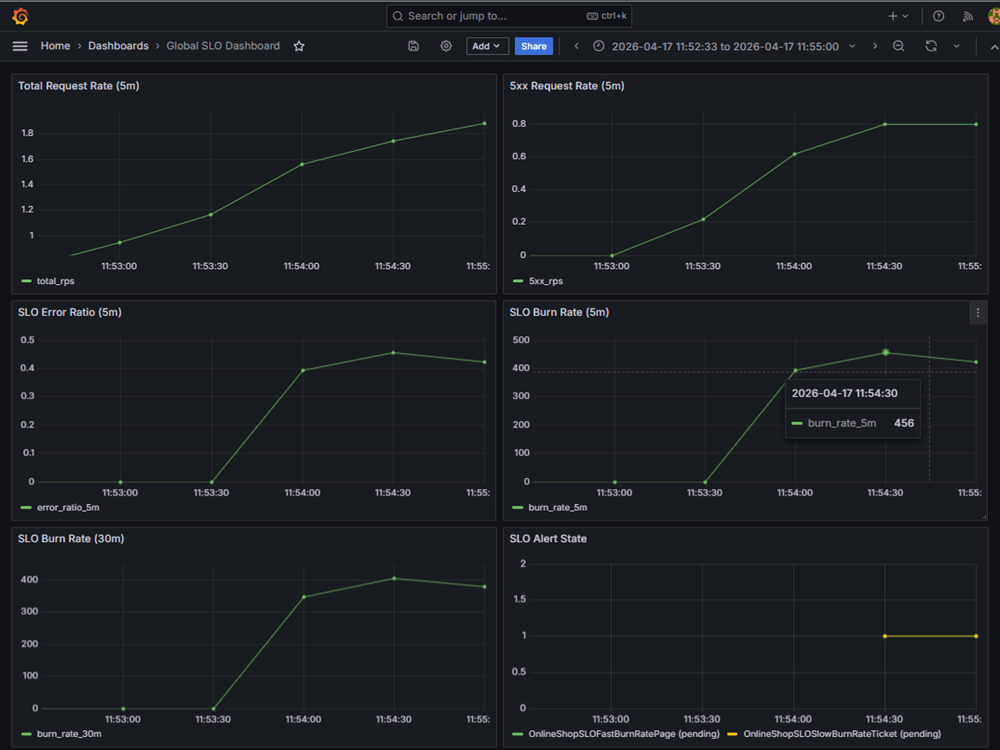
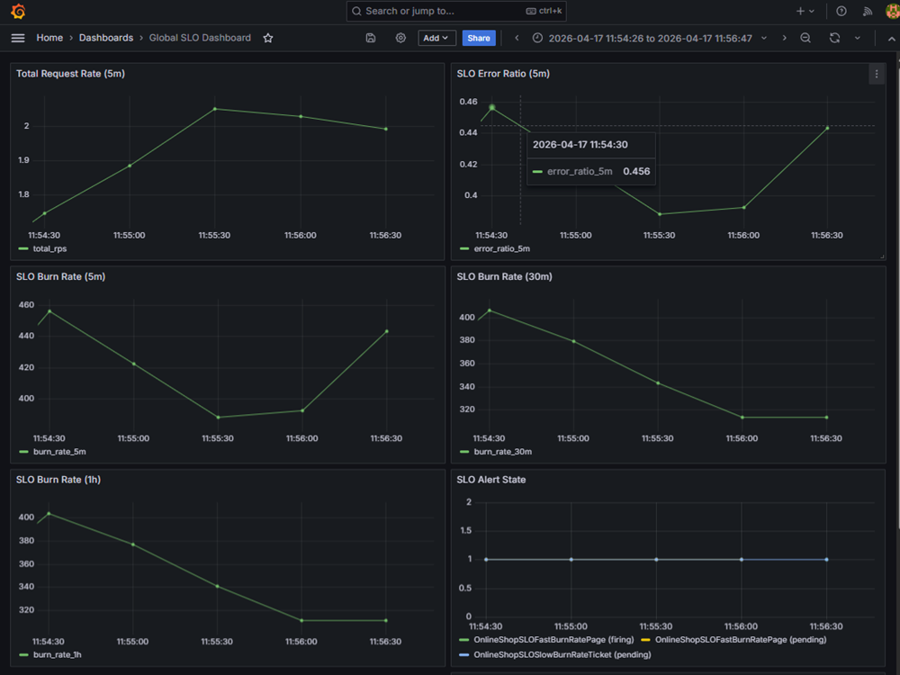
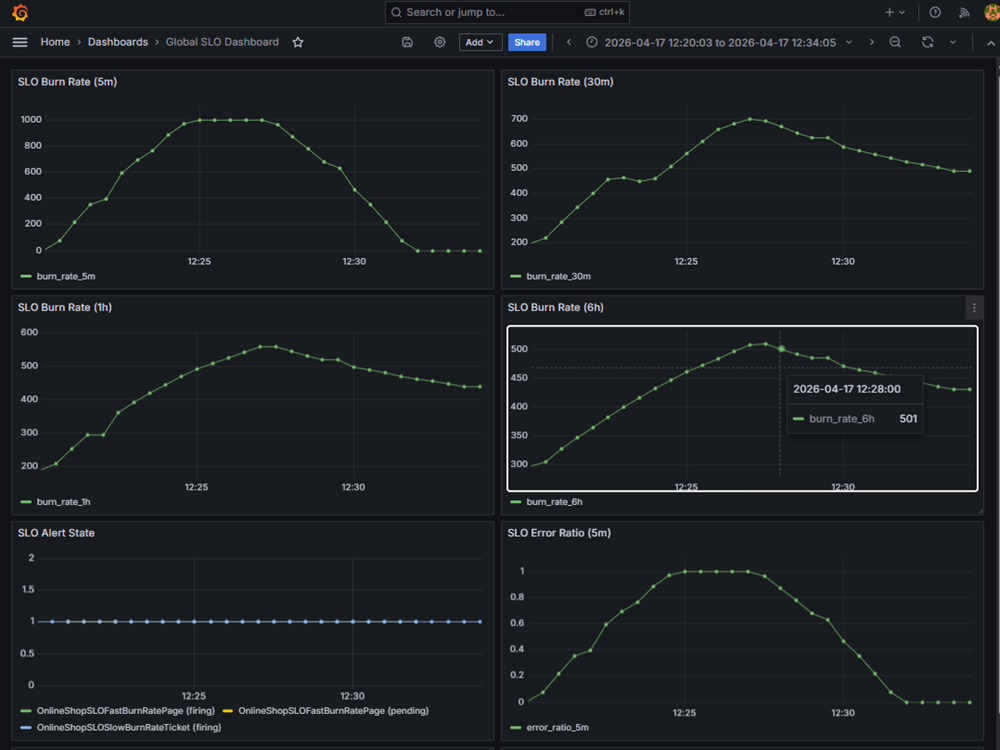
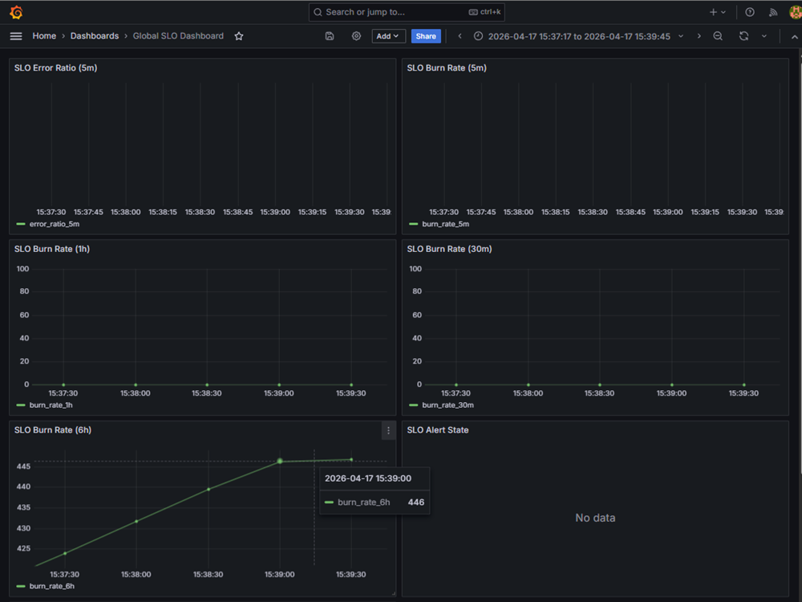

# SLO Validation — Dev Environment

## 1. Objective

Validate that the platform correctly implements SLO-based observability using:

- request-level metrics from ingress
- SLO error ratio calculations
- multi-window burn rate evaluation
- alerting based on burn rate thresholds

The goal of this validation is to confirm that the system behaves predictably under:
- normal conditions
- induced failure scenarios
- recovery

---

## 2. Validation Scope

The following components were validated:

- Ingress request metrics (`nginx_ingress_controller_requests`)
- Prometheus recording rules for:
  - `slo:error_ratio_*`
  - `slo:burn_rate_*`
- Alerting rules:
  - fast burn alerts (page-level)
  - slow burn alerts (ticket-level)
- End-to-end signal flow:
  - traffic → metrics → PromQL → alerts

Validation was performed using controlled traffic scenarios in the dev environment.

---

## 3. Validation Approach

The system was evaluated using three controlled scenarios:

### 3.1 Healthy Baseline
- steady traffic to `/`
- expected:
  - low or zero error ratio
  - burn rate near zero
  - no active alerts

### 3.2 Error Injection
- controlled traffic to `/break` producing HTTP 500
- expected:
  - increase in 5xx rate
  - increase in `slo:error_ratio`
  - sharp increase in burn rate
  - alert transition (`pending` → `firing`)

### 3.3 Recovery
- return to normal traffic
- expected:
  - decrease in error ratio
  - burn rate decay
  - eventual alert recovery (window-dependent)

---

## 4. Key Results

### 4.1 Baseline Behavior
- request traffic present and stable (~0.95 rps)
- `slo:error_ratio_5m = 0`
- `slo:burn_rate_5m = 0`
- no SLO alerts active

### 4.2 Error Reaction
- 5xx traffic successfully injected via `/break`
- `slo:error_ratio_5m ≈ 0.45`
- `slo:burn_rate_5m ≈ 450+`
- fast-burn alert transitioned to `pending` and `firing`

### 4.3 Recovery Behavior
- short-window metrics decayed after error removal
- alerts remained elevated temporarily due to window carryover
- behavior matches expected sliding-window SLO dynamics

---

## 5. Visual Evidence (Grafana)

This section provides visual confirmation of system behavior using the **Global SLO Dashboard**.

All screenshots are captured using **absolute time ranges from real validation runs**.

---

### 5.1 Baseline (Healthy System)

**Summary:**
- steady traffic (~0.95 rps)
- zero 5xx errors
- `slo:error_ratio_5m = 0`
- `slo:burn_rate_5m = 0`
- no active alerts

**Interpretation:**
The system operates within SLO with no error budget consumption.

---

### 5.2 Error Spike (Failure Injection)

**Summary:**
- `/break` produces HTTP 500 responses
- 5xx rate increases (~0.8 rps)
- `slo:error_ratio_5m ≈ 0.45`
- `slo:burn_rate_5m ≈ 450+`
- alert enters `pending`

**Interpretation:**
The system correctly detects SLO violation and reacts immediately via burn-rate escalation.

---

### 5.3 Recovery (Short-Window Decay)

**Summary:**
- error injection stopped
- `slo:error_ratio_5m` begins to decrease
- `slo:burn_rate_5m` decays
- longer windows remain elevated
- alerts still active

**Interpretation:**
Short windows recover quickly, while alert state persists due to sliding-window carryover.

---

### 5.4 Sustained Behavior (Multi-Window Model)

**Summary:**
- `slo:burn_rate_5m` reacts and recovers quickly
- `slo:burn_rate_30m` and `1h` decay slower
- `slo:burn_rate_6h` remains elevated (`~430` to `~500` in this window)
- alert lifecycle observed (pending -> firing)

**Interpretation:**
Different time windows reflect distinct aspects of error budget consumption:
- short windows -> fast detection
- long windows -> historical impact

---

### 5.5 Clean-Slate Blocker (Long-Window Carryover)

**Summary:**
- short-window burn rates return to `0`
- no active alerts
- `slo:burn_rate_6h` remains elevated (run-02 gate check: `399.6126533247256`; screenshot range still shows `~446`)

**Interpretation:**
Although the system appears healthy, it is not SLO-clean due to long-window burn persistence.

This condition correctly blocks clean-slate validation and reflects realistic SRE behavior.

---

## 6. Multi-Window Behavior

The system correctly demonstrates different time-window sensitivities:

- **5m window**
  - reacts quickly to failures
  - recovers quickly

- **30m / 1h windows**
  - react slower
  - remain elevated longer after recovery

- **6h window**
  - preserves long-term error history
  - remains elevated after short incidents

---

## 7. Alert Lifecycle

### Fast Burn Alert
- observed transitions:
  - `pending → firing → recovery`
- reacts to short-term spikes as expected

### Slow Burn Alert
- remains active due to long-window carryover
- full lifecycle not observed within short validation window

---

## 8. Observability Verification

The following were confirmed:

- Prometheus metrics are correctly scraped
- SLO recording rules evaluate continuously
- alert rules trigger based on burn-rate thresholds
- Grafana dashboard reflects:
  - request rate
  - 5xx rate
  - error ratio
  - burn rates
  - alert states

---

## 9. Known Limitations

- long-window burn (`6h`) retains historical error impact
- clean-slate validation requires sufficient decay time
- slow alert full lifecycle depends on extended observation window

These behaviors are expected and consistent with SLO theory.

---

## 10. Conclusion

The system demonstrates correct and production-like behavior for:

- request-level observability
- SLO error ratio calculation
- burn-rate evaluation across multiple windows
- alert triggering and lifecycle

The platform is validated as:

> **SLO-aware and observability-complete for dev environment scenarios**

with realistic multi-window behavior and alert dynamics.

