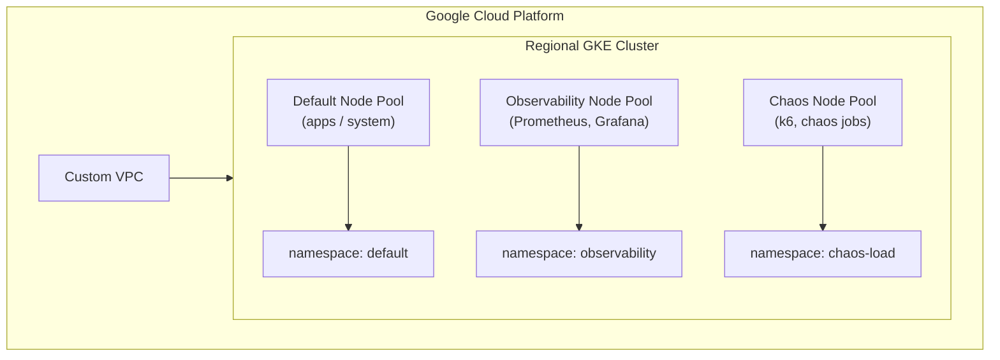

# Terraform — GKE Observability Platform

This Terraform module provisions a **production regional GKE cluster** with:
- Workload Identity
- Cluster autoscaling
- Dedicated node pools: default, observability, chaos
- Separate namespaces for observability and chaos workloads

 
## Architecture





## Folder structure
```text
terraform_modular/
├── README.md
├── networking/         # VPC + subnetwork
├── gke/                # Cluster + Node Pools + variables + provider + outputs
└── monitoring/         # Kubernetes namespaces + Workload Identity prep
```
## Deploy

```bash
terraform init
terraform apply
```


