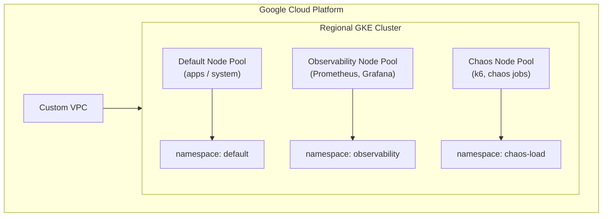

# Terraform — GKE Observability Platform

This Terraform config provisions a **production regional GKE cluster** with:
- Workload Identity
- Cluster autoscaling
- Dedicated node pools: default, observability, chaos

 
## Architecture



```mermaid
flowchart TB
    subgraph GCP["Google Cloud Platform"]
        VPC["Custom VPC"]
        subgraph GKE["Regional GKE Cluster"]
            NP1["Default Node Pool </br> (apps / system)"]
            NP2["Observability Node Pool </br> (Prometheus, Grafana)"]
            NP3["Chaos Node Pool </br> (k6, chaos jobs)"]

            NS1["namespace: default"]
            NS2["namespace: observability"]
            NS3["namespace: chaos-load"]
        end
    end

    VPC --> GKE
    NP1 --> NS1
    NP2 --> NS2
    NP3 --> NS3
```


## Folder structure
```text
terraform/
├── main.tf          # VPC + subnet + GKE cluster + node pools
├── variables.tf
├── outputs.tf
└── README.md
```
## Deploy

```bash
terraform init
terraform apply -var "project_id=YOUR_GCP_PROJECT_ID"
```

This repo's bootstrap flow uses Terraform only for infra (VPC + GKE). Kubernetes namespaces/apps are managed by Helm/ArgoCD.

